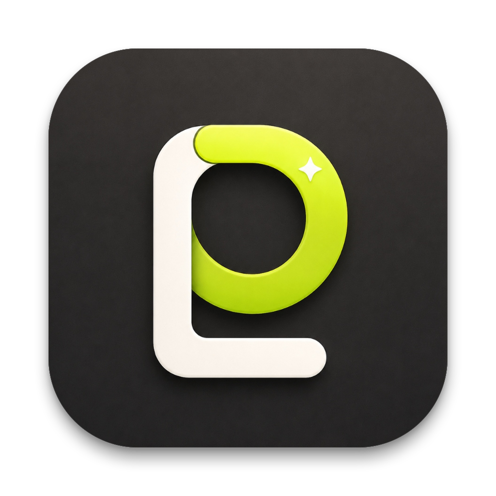

<p align="center">
  
</p>

<h1 align="center">PhraseLens</h1>

<p align="center">
  <strong>Understand any text, right where you find it.</strong><br>
  A lightweight, blazing-fast native macOS language workspace and AI translation assistant.
</p>

<p align="center">
  
  
  
  
  
  
  <a href="LICENSE"></a>
</p>

---

## Overview

**PhraseLens** is a native macOS language companion designed for seamless translation, text polishing, grammar explanation, summarization, and neural speech synthesis. 

Whether you need a lightning-fast floating pop-up beside your selected text or a full multi-tab workspace for in-depth analysis, PhraseLens integrates directly into macOS without browser extensions, web wrappers, or bloated runtimes.

<p align="center">
  <a href="#key-features">Features</a> •
  <a href="#default-shortcuts">Shortcuts</a> •
  <a href="#supported-providers">AI Providers</a> •
  <a href="#build-and-run">Build & Run</a> •
  <a href="#privacy-and-security">Privacy & Security</a> •
  <a href="#license">License</a>
</p>

---

## ✨ Why PhraseLens?

- ⚡ **100% Native Swift & SwiftUI**: Zero Electron, zero webviews, zero heavy runtimes. Starts instantly with minimal memory usage.
- 🎯 **In-Context Workflow**: Select text in any macOS application and look it up immediately without breaking your concentration.
- 🔒 **Privacy-First Architecture**: Your API keys are stored in the macOS Keychain. Requests go directly from your Mac to the chosen provider or your local offline Ollama instance.
- 🎨 **macOS Native Aesthetics**: Carefully tuned native light and dark modes following Apple HIG principles.

---

## 🚀 Key Features

| Feature | Description |
| :--- | :--- |
| 🔍 **Global Selection Lookup** | Select text anywhere in Safari, Xcode, Slack, or any app and trigger a compact pop-up right next to your cursor. |
| 🖥️ **Full Language Workspace** | Dedicated multi-tab workspace for translation, polishing, summarization, context explanation, and code analysis. |
| 💬 **Follow-Up Questions** | Keep asking about a result — examples, nuance, collocations, grammar — with one-tap suggested questions. The thread is saved with the result and reopens with it from History. |
| 📸 **Vision Screenshot OCR** | Snip any region on your screen to extract, recognize, and translate text instantly via Apple's Vision framework. |
| ✍️ **In-Place Writing & Rewrite** | Translate or polish text directly inside any active, editable text field and replace it with a single keystroke. |
| 🗣️ **Dual Speech Synthesizers** | Read source text aloud using high-fidelity **Microsoft Edge Neural TTS** or offline native **macOS System Voices**. |
| 📚 **History & Vocabulary** | Automatically preserve search histories and manage personal vocabulary collections with quick search and restore. |
| 🧩 **Custom Prompt Templates** | Create custom AI actions using dynamic variables: `${sourceLang}`, `${targetLang}`, `${text}`, and `${context}`. Duplicate any built-in action to start from its shipped prompt. |
| 🎛️ **Menu Bar & Global Hotkeys** | Lightweight `MenuBarExtra` companion, customizable global Carbon shortcuts, and launch-at-login support. |

---

## ⌨️ Default Shortcuts

| Action | Shortcut | Required Permission |
| :--- | :---: | :--- |
| **Translate Selected Text** *(Compact Pop-up)* | <kbd>⌥</kbd> <kbd>F</kbd> | macOS Accessibility |
| **Open Full Workspace** | <kbd>⌥</kbd> <kbd>⇧</kbd> <kbd>F</kbd> | None |
| **Screenshot OCR** | <kbd>⌥</kbd> <kbd>S</kbd> | Screen Recording |
| **Translate & Replace in Focused Field** | <kbd>⌥</kbd> <kbd>W</kbd> | macOS Accessibility |
| **Ask a Follow-Up** *(in-app)* | <kbd>⌘</kbd> <kbd>L</kbd> | None |
| **Switch Action** *(in-app)* | <kbd>⌘</kbd> <kbd>1</kbd>…<kbd>9</kbd> | None |
| **Next / Previous Action** *(in-app)* | <kbd>⌘</kbd> <kbd>⇧</kbd> <kbd>]</kbd> / <kbd>[</kbd> | None |

> [!NOTE]
> All shortcuts are fully customizable in **Settings > Shortcuts**. 
> Selection lookup and in-place writing require **macOS Accessibility** permission. Screenshot OCR requires **Screen Recording** permission.

---

## 🤖 Supported AI Providers

PhraseLens supports direct streaming connections to major cloud providers, local offline models, and custom endpoints:

| Provider | Type | Supported Models / Notes |
| :--- | :---: | :--- |
| **OpenAI** | Cloud | GPT-4o, GPT-4o-mini, o1, o3-mini, and compatible models |
| **Anthropic Claude** | Cloud | Claude 3.5 Sonnet, Claude 3.7 Sonnet, Claude 3 Haiku |
| **Google Gemini** | Cloud | Gemini 2.0 Flash, Gemini 1.5 Pro / Flash |
| **Ollama** | Local / Offline | Fully private & offline (Llama 3, Qwen 2.5, DeepSeek-R1, Mistral, etc.) |
| **DeepSeek** | Cloud | DeepSeek-V3, DeepSeek-R1 |
| **Groq** | Cloud | Ultra-low latency inference (Llama, Gemma, Mixtral) |
| **Moonshot (Kimi)** | Cloud | Moonshot v1 models with long context |
| **MiniMax** | Cloud | MiniMax-Text-01 and chat models |
| **Cohere** | Cloud | Command R, Command R+ |
| **Azure OpenAI** | Cloud / Enterprise | Custom deployments & enterprise endpoints |
| **TeamoRouter** | Router | Multi-model routing endpoint |
| **Custom Endpoint** | Any | Any OpenAI-compatible REST endpoint (`/v1/chat/completions`) |

---

## 📋 Requirements

- **Operating System**: macOS 14.0 (Sonoma) or newer (macOS 15 Sequoia fully supported)
- **Toolchain**: Swift 6.2 or Xcode 16+ (for compiling from source)
- **API Access**: An API key from your preferred provider, or a local running [Ollama](https://ollama.com) instance

---

## 📥 Install

Grab the latest `PhraseLens.dmg` or `PhraseLens.zip` from the [Releases page](https://github.com/mxggle/phrase-lens/releases/latest), then drag **PhraseLens.app** into your **Applications** folder.

### Opening it the first time

Release builds are code-signed but **not yet notarized by Apple**, so macOS blocks the first launch with *"PhraseLens cannot be opened because Apple cannot check it for malicious software."* This is expected. To open it:

1. Right-click (or Control-click) **PhraseLens.app** in Applications and choose **Open**.
2. Click **Open** again in the dialog that appears.

Alternatively, launch it once normally, then go to **System Settings → Privacy & Security**, scroll to the Security section, and click **Open Anyway** next to the PhraseLens message.

You only need to do this once. macOS remembers the choice for every later launch and update.

> [!NOTE]
> Don't disable Gatekeeper system-wide to work around this. The steps above approve this one app and leave the rest of your Mac protected.

### Granting permissions

On first use PhraseLens asks for **Accessibility** permission, which is what lets it read the text you have selected in other apps and write replacements back. Grant it in **System Settings → Privacy & Security → Accessibility**. Screenshot OCR additionally uses **Screen Recording** permission.

---

## 🛠️ Build and Run

### Clone the Repository

```bash
git clone https://github.com/mxggle/phrase-lens.git
cd phrase-lens
```

### Quick Run (Development)

Builds the release executable, packages the bundle, signs it with local identity, and launches the app:

```bash
./scripts/run.sh
```

> [!TIP]
> Always run via the packaged `.app` bundle (or `./scripts/run.sh`) rather than the raw SwiftPM binary, as macOS Accessibility and Screen Recording permissions are bound to the signed application bundle identifier.

### Automated Self-Tests

Run the built-in test suite to verify prompt isolation, context boundary enforcement (1,600 chars), SSE stream decoders, and hotkey parsing:

```bash
./scripts/test.sh
```

### Package DMG & ZIP Releases

Generate production artifacts inside the `dist/` directory:

```bash
./scripts/package-app.sh
```

Output artifacts:
```text
dist/
├── PhraseLens.app      # Signed application bundle
├── PhraseLens.zip      # Compressed archive
└── PhraseLens.dmg      # Drag-and-drop installer disk image
```

---

## 🔒 Privacy and Security

PhraseLens is designed with a zero-trust, privacy-first mindset:

- **Keychain Storage**: All provider API keys and credentials are encrypted and stored in the **macOS Keychain**. Keys never touch `UserDefaults`, plaintext files, or application logs.
- **Direct Network Communication**: API requests travel directly between your Mac and the target AI service. PhraseLens has no backend server, proxy, or analytics telemetry.
- **HTTPS Enforcement**: Plain HTTP connections are strictly blocked, with an explicit exception only allowed for local `localhost` / `127.0.0.1` Ollama endpoints.
- **Untrusted Context Isolation**: Text selected from external applications is bounded (1,600 characters max) and treated as untrusted prompt data to prevent prompt injection.
- **Local Data**: Translation history, vocabulary cards, custom action definitions, and user settings reside strictly on your local disk.

---

## 🧩 Custom Prompt Actions

You can expand PhraseLens by defining custom prompt templates in **Settings > Actions**. Templates support variable interpolation:

```text
${sourceLang} -> Detected or chosen source language
${targetLang} -> Target language for output
${text}       -> User input or selected text
${context}    -> Text surrounding the selection, when captured
```

Example custom action (Grammar & Style Doctor):
```text
Analyze the following ${sourceLang} text for grammatical issues, awkward phrasing, and tone improvements. Provide concise suggestions in ${targetLang}:

${text}
```

---

## 📂 Project Structure

```text
Sources/PhraseLens/
├── App/          # Application entry, lifecycle, and environment state
├── Models/       # Settings, provider profiles, action templates, history models
├── Services/     # Translation clients, Accessibility, Vision OCR, TTS, hotkeys
└── Views/        # SwiftUI workspace, compact pop-up, settings, history, actions
packaging/        # App icons (icns, png) and Info.plist metadata
scripts/          # Automation scripts for test, run, package, and icon generation
docs/             # Design system specifications and feature coverage matrix
```

---

## 📄 License & Acknowledgments

PhraseLens is released under the **GNU Affero General Public License v3.0 (AGPL-3.0)**. See the [LICENSE](LICENSE) and [NOTICE](NOTICE) files for details.

This project is a native Swift implementation built from the ground up, inspired by the concepts and behaviors of [NextAI Translator](https://github.com/nextai-translator/nextai-translator).
